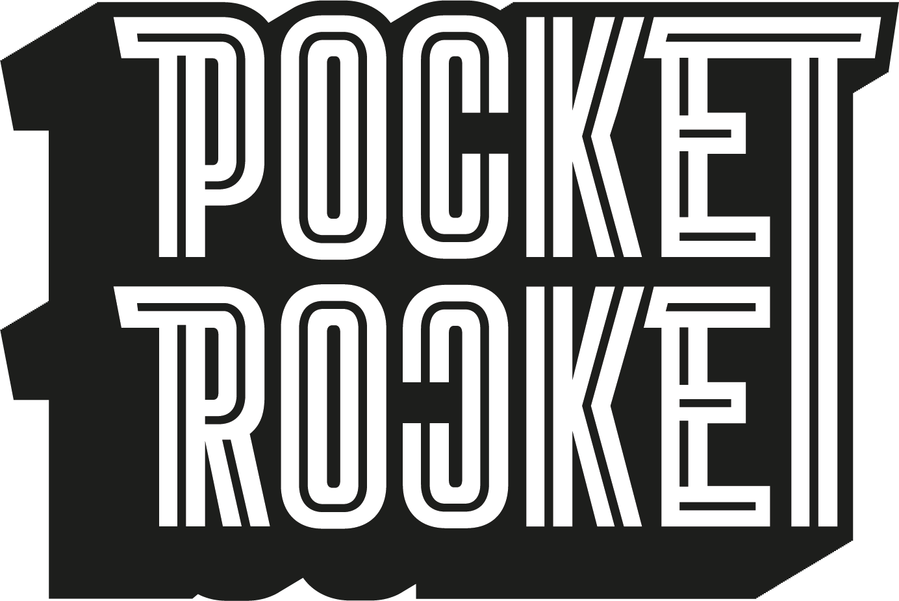

# rocketfuel.sass
App-like mobile apps with ease 🚀
  
Rocketfuel helps building up mobile views built in HTML/CSS. It is no full-blown CSS framework, but especially handles layouting responsive fullscreen views.

<a href="https://www.npmjs.com/package/@pocket-rocket/rocketfuel">
  
</a>

## Install

### Manual
1. Copy the contents of `/src` in a dedicated folder in your project (eg `/assets/rocketfuel`)
2. Import with `@import 'rocketfuel'` (mind the relative path)

### Better: Use npm

```sh
npm install @pocket-rocket/rocketfuel
```

Then import the module in your manifest css file (eg `main.sass`) with

```scss
@import "@pocket-rocket/rocketfuel"
```


⚠️ **Please be aware, that you need to have SASS available in your project, eg. by adding `node-sass` or `dart-sass`.**

## Usage
- Wrap every view in a wrapper with the `viewport` class

### Building a scrollable view
- Just throw all your content in the `viewport` wrapper
- The viewport will be automatically be scrollable, if the content runs out of view

### Building a fixed fullscreen view
- Add the modifier class `is-fullscreen` to the `viewport` wrapper
- Inside, build your layout using the following classes:

| Class | Range | Description |
|--|--|--|
| `.abs-*` | 1 - 50 | Absolute height in `rem` |
| `.rel-*` | 1 - 100 | Relative height in `%` |
| `.flex` | none | Fill the remaining space |

**An example for a Vue.js view:**
```html
<template>
  <div class="viewport mimimi-intro">
    <div class="rel-25">
      
    </div>
    <div class="flex">
      
    </div>
    <div class="abs-10"></div>
    <div class="flex"></div>
  </div>  
</template>  
```

In this example, the first row takes up `25%` of the viewport. The third row takes up exactly `10rem`. The second and fourth row distribute the remaining space equally.

## Spacing
Rocketfuel comes with handy spacing helpers, that makes positioning very comfy and flexible. It is heavily inspired by [Bulma.io](http://www.bulma.io)

The spacing helper classes are composed of three elements: 
- margin/padding (`m`/`p`)
- side:
  - `t`/`r`/`b`/`l` for top/right/bottom/left
  - `x`/`y` for left *and* right / top *and* bottom
  - `<none>` for all sides
- `-` Separator
- value: `0` to `6` (0/0.25rem/0.5rem/0.75rem/1rem/1.5rem/3rem)

**Examples:**
```css
.mr-4  \\ 1rem right margin
.px-3  \\ 0.75rem padding on left and right
.m-1   \\ 0.25rem margin on all sides
```

## Image sizing
Images are automatically scaled to 100% of their parent container, thus always wrap images in a parent wrapper and define the height with that. In case you really need to scale an image, you need to modify `min-height` with a relative value (eg. `90%`). Do **not** set `height` directly.

## Positioning
If you need to position an image or other element, use the `transform` property, whenever possible. Do **not** position elements with `position: fixed` or `position: absolute` unless you're absolutely sure, what you're doing :)

In most cases you can just use the spacing helpers described above.


## Contributing and Releasing
Please see [RELEASING.md](RELEASING.md) for all relevant infos when working on this package.

## Copyright and license
&copy; 2022 Pocket Rocket GmbH

Code released under the MIT license.
